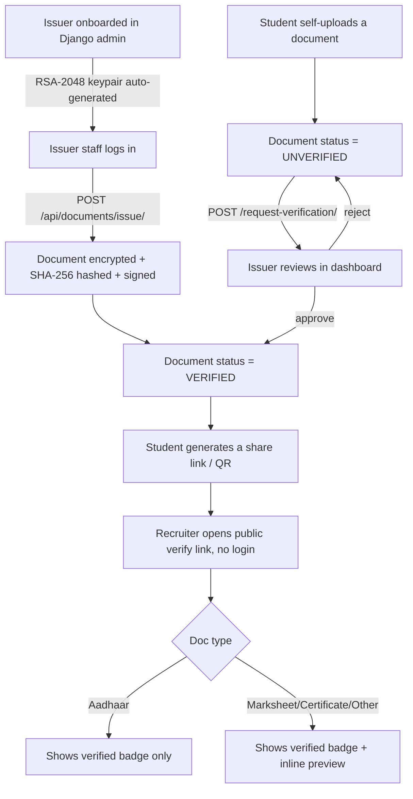

# DigiDocker

A secure, self-hosted document locker (à la DigiLocker) for students: colleges digitally
sign marksheets/degrees, and a mock UIDAI issuer can do the same for Aadhaar. Verification
is 100% automatic — nobody clicks "approve"; a document is `VERIFIED` only if its content
hash matches a signature produced by the issuer's own private key.

## Why no manual approval?

Real DigiLocker documents are signed by government-approved Digital Signature Certificates,
which require paid CA infrastructure this project doesn't have access to. Instead, each
**Issuer** (a college, or a UIDAI-mock) gets its own RSA-2048 keypair generated on
onboarding. When an issuer issues a document to a student, it signs the file's SHA-256 hash
with its private key — that signature *is* the verification. A student can also self-upload
a copy; it's auto-marked `VERIFIED` only if the hash matches something the claimed issuer
already issued them, otherwise it's stored securely but flagged `UNVERIFIED`. There is no
admin approval queue anywhere (`documents/admin.py` is intentionally read-only).

## Placement use case

A student going for placement doesn't carry paper documents. For each verified document
they can share a link/QR code (`/api/documents/<id>/share/qr/`) pointing at
`/api/documents/verify/<share_token>/` — a public, no-login page showing "Verified by
ABC College ✅" without exposing the raw file. The token can be rotated
(`/share/regenerate/`) to revoke old links.

## How it works



## Screenshots

| Student dashboard | Public verify page (via shared link/QR) |
| --- | --- |
|  |  |

## Tech stack

- Django + Django REST Framework, JWT auth (`djangorestframework-simplejwt`)
- PostgreSQL (default) — MySQL supported by setting `DB_ENGINE=mysql`
- AES-256-GCM envelope encryption for files at rest (`cryptography` lib)
- RSA-2048/PSS digital signatures for issuer verification
- `tenacity` retry-with-backoff for transient storage/DB errors
- PgBouncer connection pooling in front of Postgres (docker-compose)
- Docker + docker-compose

## Project layout

```
digidocker/     project settings & URLs
accounts/       custom User (STUDENT/ISSUER role), JWT auth endpoints
issuers/        Issuer model (RSA keypair), onboarded via Django admin
documents/      Document model, issue/upload/download/verify/share endpoints
common/crypto.py  shared AES/RSA helpers (not a Django app)
```

## Running locally without Docker (SQLite, for quick dev/testing)

```powershell
py -m venv venv
.\venv\Scripts\python.exe -m pip install -r requirements.txt
copy .env.example .env   # then fill in DJANGO_SECRET_KEY, MASTER_ENCRYPTION_KEY, DB_ENGINE=sqlite
.\venv\Scripts\python.exe manage.py migrate
.\venv\Scripts\python.exe manage.py createsuperuser
.\venv\Scripts\python.exe manage.py runserver
```

Generate a master key with:
```powershell
py -c "import secrets,base64; print(base64.urlsafe_b64encode(secrets.token_bytes(32)).decode())"
```

## Running with Docker (Postgres + PgBouncer)

```powershell
copy .env.example .env   # fill in secrets, leave DB_ENGINE=postgres
docker compose up --build
```

## Deploying to production (VPS + Caddy, automatic HTTPS)

The `caddy` service in `docker-compose.yml` terminates TLS in front of gunicorn and
gets a free Let's Encrypt certificate automatically — no domain purchase required if
you don't have one yet (a free hostname like `<server-ip>.nip.io` works with Caddy).

1. Provision a VPS (DigitalOcean/Hetzner/Linode all work) with Docker + Docker Compose
   installed, and point DNS (or a `nip.io` hostname) at its public IP.
2. Open ports 80 and 443 in the VPS firewall (Caddy needs both for the ACME challenge
   and HTTPS).
3. Copy the repo to the server, then create `.env` with, at minimum:
   - `DJANGO_DEBUG=0`
   - `DJANGO_SECRET_KEY=<random, generate with the command below>`
   - `DJANGO_ALLOWED_HOSTS=<your-domain-or-nip.io-host>`
   - `DJANGO_CSRF_TRUSTED_ORIGINS=https://<your-domain-or-nip.io-host>`
   - `MASTER_ENCRYPTION_KEY=<random, generate with the command below>`
   - `CADDY_DOMAIN=<your-domain-or-nip.io-host>`
   - `POSTGRES_DB`, `POSTGRES_USER`, `POSTGRES_PASSWORD`
4. `docker compose up -d --build` — Caddy will obtain the certificate on first boot.
5. `docker compose exec web python manage.py createsuperuser` to bootstrap the first
   admin (used to onboard Issuers).

Back up the Postgres volume and `MASTER_ENCRYPTION_KEY` regularly — losing either makes
already-stored encrypted documents unrecoverable.

## Typical flow

1. Platform operator creates an `Issuer` in Django admin (e.g. "ABC Engineering College") —
   this auto-generates its RSA keypair. Add issuer staff users (role=ISSUER) to it.
2. Issuer staff logs in, calls `POST /api/documents/issue/` with the student's roll number
   and file — document is encrypted, hashed, signed, and marked `VERIFIED` instantly.
3. Student logs in, sees all their verified documents via `GET /api/documents/`.
4. Student shares a document's verify link/QR with a recruiter — no login needed to view
   the verification status.

## Security notes

- Files are never stored in plaintext; each document has its own AES-256 data key, itself
  encrypted by a server-wide master key (envelope encryption).
- Issuer private keys never leave the server and are themselves encrypted at rest.
- RBAC enforced via DRF permission classes (`IsIssuerStaff`, `IsDocumentOwnerOrIssuingStaff`).

## Local test accounts (SQLite dev DB only, not for production)

| Username | Password | Role |
| --- | --- | --- |
| `admin` | `AdminPass123!` | Superuser |
| `college_staff` | `CollegePass123!` | Issuer staff (ABC Engineering College) |
| `university_staff` | `UniPass123!` | Issuer staff (State Technical University) |
| `rahul_student` | `StudentPass123!` | Student (roll `CS2021001`) |
| `nandini_student` | `NandiniPass123!` | Student (roll `CS2021099`) |
