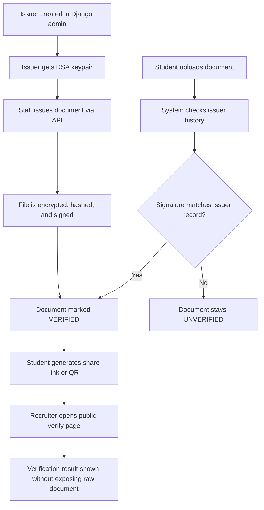
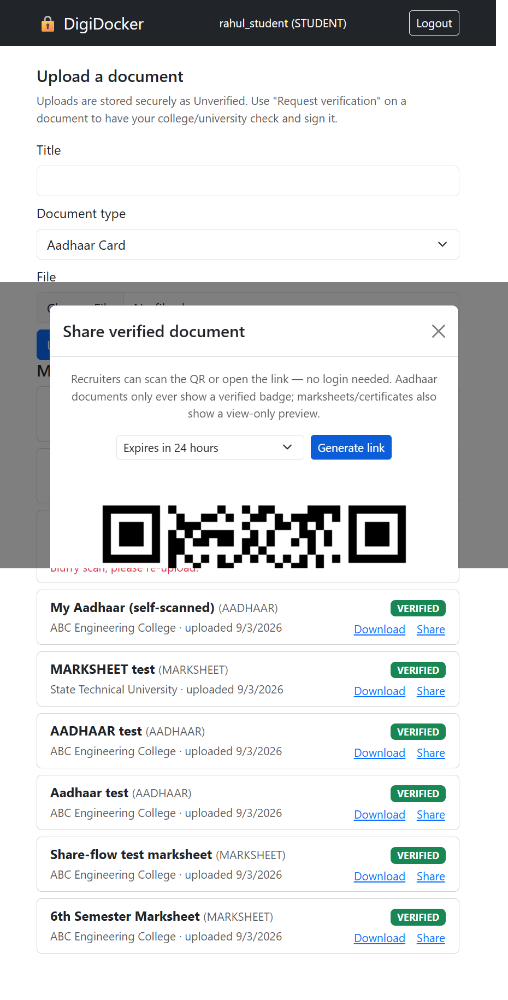
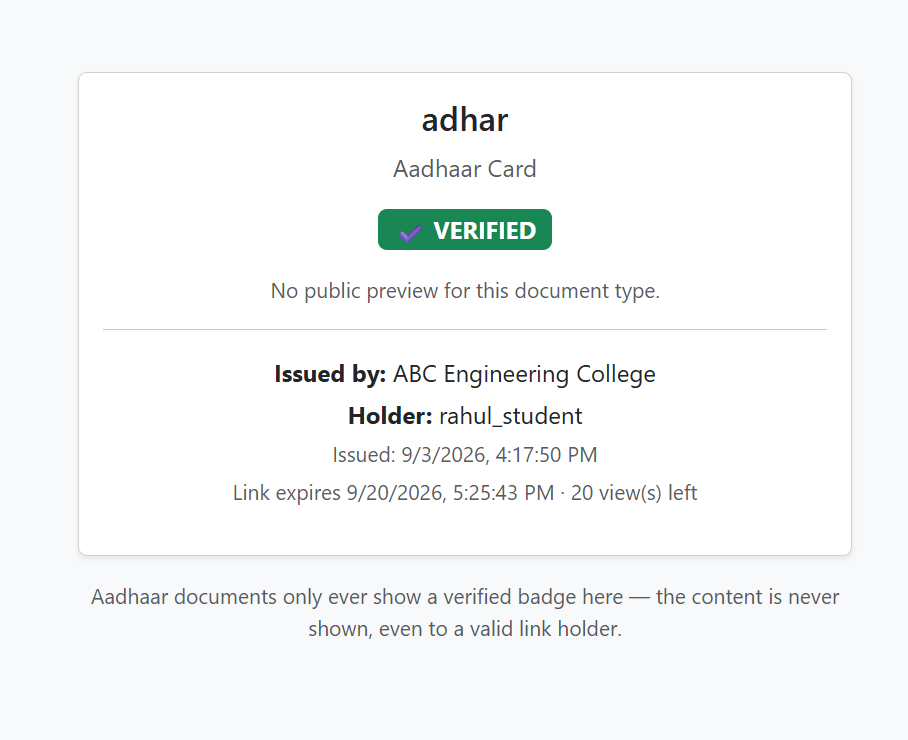

# DigiDocker

DigiDocker is a secure, self-hosted digital document verification platform inspired by DigiLocker. It lets institutions issue verified academic and identity documents, students manage and share them, and recruiters verify authenticity without exposing the raw files.

The system is built around signed document verification: every issued record is encrypted, hashed, and signed with an issuer-specific RSA key. Verification is automatic, and a document is marked as verified only when the issuer signature matches the document content.

## What this project includes

- Student portal for document uploads, verification status, and sharing
- Issuer workflows for issuing signed academic and identity records
- Public verification pages with share links and QR-based access
- Secure storage with encryption at rest and digital signatures
- Dockerized deployment with Django, PostgreSQL, Caddy, and PgBouncer
- Web frontend and backend API working together in one platform

## Core project components

### 1. Accounts
The `accounts` app defines the platform user model and role-based access. Users are separated into student and issuer staff roles, with JWT-based authentication and endpoint-level authorization to keep the flow secure and organized.

### 2. Issuers
The `issuers` app models official issuers such as colleges and mock government entities. Each issuer gets an RSA keypair on onboarding, and those keys are used to sign issued documents so verifiers can confirm authenticity.

### 3. Documents
The `documents` app is the heart of the platform. It handles:
- document upload and encryption
- hash generation and signature validation
- verified vs unverified status tracking
- document sharing links and QR generation
- public verification pages for recruiters and third parties

### 4. Web app
The `webapp` module provides the user-facing dashboard and verification pages, making the platform accessible for both end users and public verification flows.

### 5. Infrastructure
The project includes production-style deployment components:
- Django application server
- PostgreSQL database
- PgBouncer connection pooling
- Caddy reverse proxy with HTTPS automation
- Docker Compose orchestration for a full deployment setup

## How verification works



## Tech stack

- Django + Django REST Framework
- JWT authentication
- PostgreSQL with PgBouncer
- AES-256-GCM encryption for stored document content
- RSA-2048 digital signatures for issuer verification
- Docker + Docker Compose
- Caddy for HTTPS termination and automatic certificate provisioning

## Project structure

```text
digidocker/        Django project configuration and settings
accounts/         user roles, auth, and account workflows
issuers/          issuer onboarding and RSA signing model
documents/        document issuing, verification, sharing, and APIs
webapp/           dashboard and public verification UI
common/           shared security helpers and utilities
media/            encrypted document storage
```

## Screenshots

| Student dashboard | Public verification page |
| --- | --- |
|  |  |

## Quick start with Docker

```powershell
copy .env.example .env
docker compose up --build
```

This brings up the application stack with the configured database, web service, and reverse proxy.

## Local development setup

```powershell
py -m venv venv
.\venv\Scripts\python.exe -m pip install -r requirements.txt
copy .env.example .env
.\venv\Scripts\python.exe manage.py migrate
.\venv\Scripts\python.exe manage.py createsuperuser
.\venv\Scripts\python.exe manage.py runserver
```

Generate a secure master encryption key:

```powershell
py -c "import secrets,base64; print(base64.urlsafe_b64encode(secrets.token_bytes(32)).decode())"
```

## Deployment

The project is designed to run as a containerized application behind Caddy with automatic HTTPS certificate management. The configuration in `docker-compose.yml` exposes the app through a reverse proxy and supports a straightforward deployment flow for a VPS or hosting environment.

## Typical user flow

1. An institution or issuer is created and configured in the admin panel.
2. The issuer signs and issues documents to students through the API.
3. Students view their verified documents in the dashboard.
4. Students share a verification link or QR code with recruiters or third parties.
5. The public verification page confirms the document is genuine without exposing the original file.

## Security model

- Files are encrypted before storage using envelope encryption.
- Every issuer document is tied to a unique cryptographic signature.
- Verification depends on the issuer identity and signed content hash.
- Access control is enforced through role-aware permissions for students and issuer staff.

## Demo accounts

| Username | Password | Role |
| --- | --- | --- |
| `admin` | `AdminPass123!` | Superuser |
| `college_staff` | `CollegePass123!` | Issuer staff |
| `university_staff` | `UniPass123!` | Issuer staff |
| `rahul_student` | `StudentPass123!` | Student |
| `nandini_student` | `NandiniPass123!` | Student |

## Summary

DigiDocker combines secure digital identity workflows, document verification, and self-hosted infrastructure into a complete platform that feels ready for real usage. It connects issuer trust, student document management, and public verification in one system that is easy to run locally and deploy with Docker.

